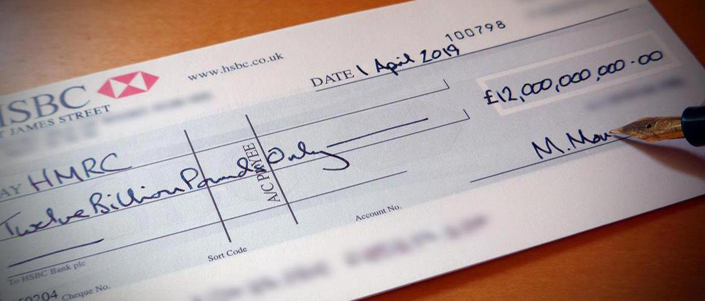

# Automatic-Cheque-Processing
 - Using Computer Vision we try to identify the fields in a Cheque Slip for Verification and capture the Signature for Validation.

 - User will only have to upload the image of the Cheque Slip (in good lightning condition)

